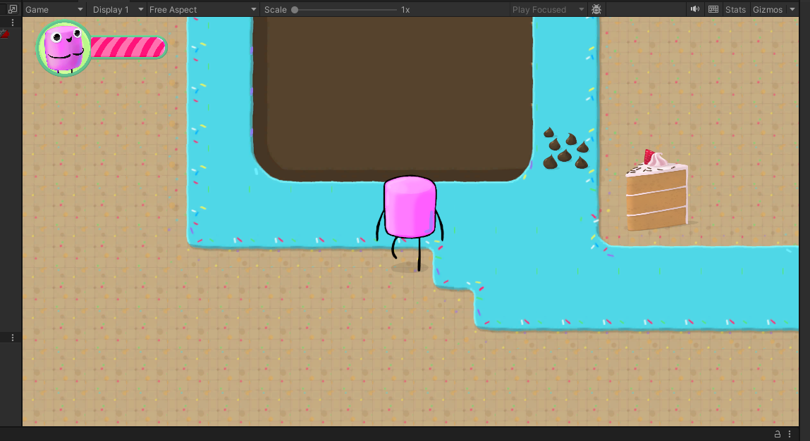
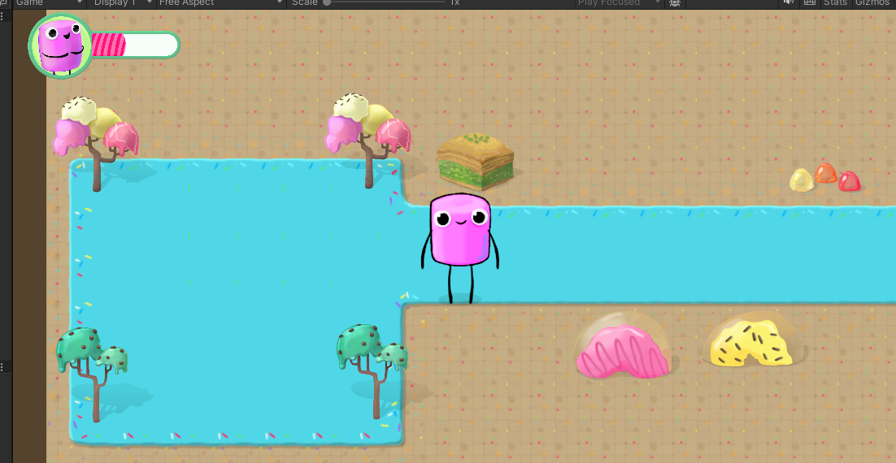
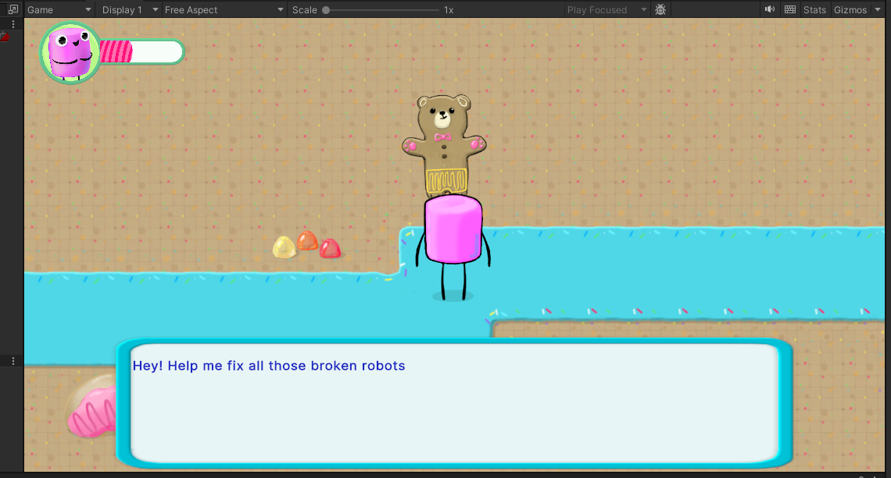
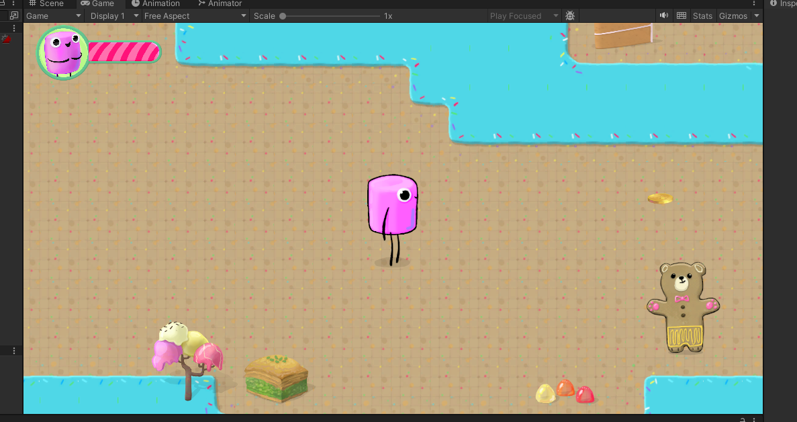
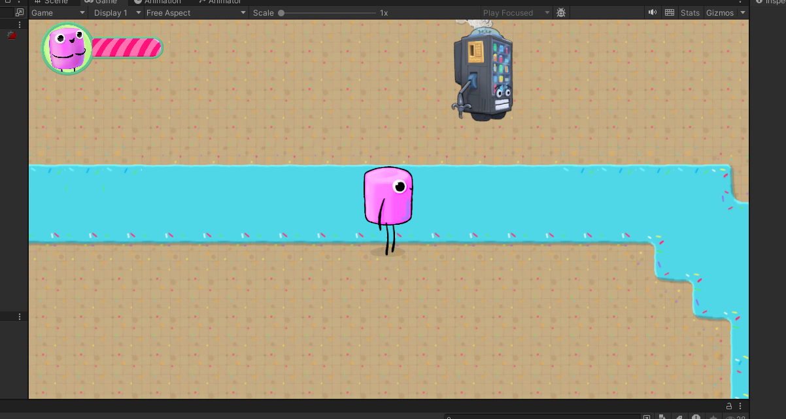
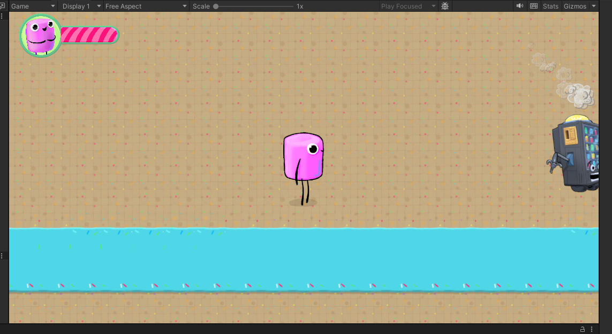

# Adventure Game
## Starting position of the game
The top left of the screen shows the lives (5 by default). The character moves with the arrows on your keyboard. The path and the decoration were placed/positioned by me.

## Boundary
The outside of the map and this water are boundaries, so the character can't run over it

## Spikes
There are also spikes that reduce your lives by one.

## Candy
When running over the candy, on live is added.

## NPC
There is also an npc. You have to be next to and facing him to talk to him (by pressing X). A prompt is then shown for a couple of seconds.

## Projectile
When pressing C, a projectile is thrown.

## Enemy
There is also an enemy that walks left and right. When running over it, the lives are reduced by one again. When throwing the projectile against it, the enemy is "fixed" and stops moving/doing damage.

## Sound
The game also has sounds, like the walking of the enemy, where the closed you are, the louder it gets. Also general music in the background and also a sound when getting hurt.
